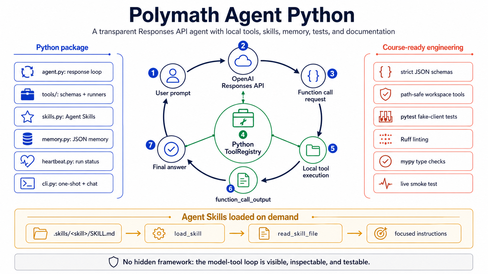

# Polymath Agent Python



Polymath Agent Python is a course-ready Python copy of
[`BirgerMoell/agents`](https://github.com/BirgerMoell/agents). The original project is a compact
TypeScript agent that uses the OpenAI Responses API, function tools, and local Agent Skills. This
version keeps that spirit and turns it into a polished Python package with strong typing, tests,
safe path handling, persistent memory, a heartbeat file, and detailed documentation.

The goal is not to hide the agent behind a framework. The goal is to make every important moving
part understandable:

- how a model requests tool calls
- how Python executes those tools
- how tool outputs are returned to the model
- how skills are discovered and loaded only when needed
- how local state can be stored without a database

## Features

- **OpenAI Responses API loop** using `client.responses.create(...)`.
- **Strict JSON-schema function tools** for file reading, directory listing, search, URL fetches,
  ping, Bash, skills, and memory.
- **Agent Skills support** compatible with the `.skills/<skill-name>/SKILL.md` layout.
- **Path-safe workspace tools** that prevent file reads and directory listings outside the
  configured workspace.
- **Persistent JSON memory** through `remember`, `recall_memory`, and `forget_memory`.
- **Heartbeat file** at `.polymath/heartbeat.json` for observing a running agent.
- **One-shot and interactive CLI modes**.
- **Tests with a fake OpenAI client**, so CI and grading do not require an API key.

## Quick Start

```bash
python3 -m venv .venv
source .venv/bin/activate
python -m pip install -e ".[dev]"
cp .env.example .env
```

Edit `.env` and set `OPENAI_API_KEY`.

Run a one-shot prompt:

```bash
polymath-agent "List the files in this project and summarize what each top-level folder does."
```

Run interactive mode:

```bash
polymath-agent
```

Run tests:

```bash
python -m pytest
python -m ruff check .
python -m mypy src tests scripts
```

Run a live end-to-end smoke test after setting `OPENAI_API_KEY`:

```bash
PYTHONPATH=src python scripts/live_smoke.py
```

The live smoke test makes one billable API call, asks the model to use `list_dir`, and fails if no
tool call happens.

## Configuration

| Setting | Default | Description |
| --- | --- | --- |
| `OPENAI_API_KEY` | required | API key used by the OpenAI Python SDK. |
| `POLYMATH_MODEL` | `gpt-5.5` | Model used by the agent unless `--model` is passed. |
| `SKILLS_DIR` | `.skills` | Directory that contains Agent Skills. |
| `--workspace` | `.` | Root directory exposed to workspace tools. |
| `--memory-file` | `.polymath/memory.json` | JSON file used by memory tools. |
| `--heartbeat-file` | `.polymath/heartbeat.json` | JSON file updated as the agent runs. |
| `--max-tool-rounds` | `8` | Maximum model/tool continuation rounds per user turn. |

The default model follows OpenAI's current model guidance, while the code remains model-agnostic.
Change `POLYMATH_MODEL` or pass `--model` if your account, assignment, or budget requires a
different model.

## Project Map

```text
.
+-- src/polymath_agent/       # Python package
|   +-- agent.py              # Responses API loop and tool-call handling
|   +-- cli.py                # Command-line entrypoint
|   +-- config.py             # Runtime configuration
|   +-- heartbeat.py          # JSON heartbeat snapshots
|   +-- memory.py             # JSON-backed key-value memory
|   +-- skills.py             # Agent Skills discovery and loading
|   +-- tools/                # Tool schemas and runners
+-- .skills/                  # Example skills copied from the original project
+-- docs/                     # Architecture, tools, skills, security, and development notes
+-- examples/                 # Example prompts and extension ideas
+-- tests/                    # Unit tests that do not call the live API
```

## How A Turn Works

1. The CLI passes a user message to `PolymathAgent.turn(...)`.
2. The agent sends the message, system prompt, and tool schemas to the Responses API.
3. If the model returns function calls, the agent parses each call's JSON arguments.
4. The local `ToolRegistry` runs the requested tools.
5. Tool outputs are sent back as `function_call_output` items with the previous response ID.
6. The loop continues until the model returns normal text or the tool-round limit is reached.

See [docs/architecture.md](docs/architecture.md) for a deeper walkthrough.

## Tool Safety

Most tools are narrow and workspace-scoped. `read_file`, `list_dir`, and `search_files` cannot
escape the configured workspace. `fetch_url` only allows HTTP and HTTPS. `ping` uses argument-list
subprocess execution rather than shell interpolation.

`bash` is intentionally powerful because the original project included a general shell tool. It is
documented as risky, has a timeout, captures output, and should only be used when narrower tools are
insufficient.

See [docs/security.md](docs/security.md) for the security model and remaining risks.

## Agent Skills

Skills live under `.skills` and each skill has a `SKILL.md` file:

```text
.skills/
+-- weather-finder/
    +-- SKILL.md
```

At startup, the agent injects lightweight skill metadata into the system prompt. When a task matches
a skill, the model can call `load_skill` to load the full instructions and `read_skill_file` to load
files from `scripts/`, `references/`, or `assets/`.

See [docs/skills.md](docs/skills.md) and [.skills/README.md](.skills/README.md).

## Documentation Index

- [Architecture](docs/architecture.md)
- [README Hero Infographic Prompt](docs/infographic-prompt.md)
- [Tool Contracts](docs/tools.md)
- [Agent Skills](docs/skills.md)
- [Security Notes](docs/security.md)
- [Development Workflow](docs/development.md)
- [Course Notes](docs/course-notes.md)
- [Package Internals](src/polymath_agent/README.md)
- [Tool Internals](src/polymath_agent/tools/README.md)
- [Tests](tests/README.md)
- [Examples](examples/README.md)
- [Live smoke test](scripts/live_smoke.py)

## OpenAI References

This project uses the documented Responses API function-calling flow:

- [Responses API reference](https://platform.openai.com/docs/api-reference/responses)
- [Function calling guide](https://platform.openai.com/docs/guides/function-calling?api-mode=responses&lang=python)
- [Models overview](https://developers.openai.com/api/docs/models)

## Differences From The Original TypeScript Project

The original project is intentionally small and direct. This Python version is still readable, but
adds course-friendly engineering:

- package layout instead of root-level scripts
- unit tests for deterministic behavior
- safer subprocess usage for `ping`
- stricter workspace path boundaries
- JSON memory and heartbeat files
- documentation for each subsystem
- CLI flags for model, workspace, skills, memory, and heartbeat paths

The agent remains intentionally transparent: no hidden framework, no database requirement, and no
live API calls in tests.
