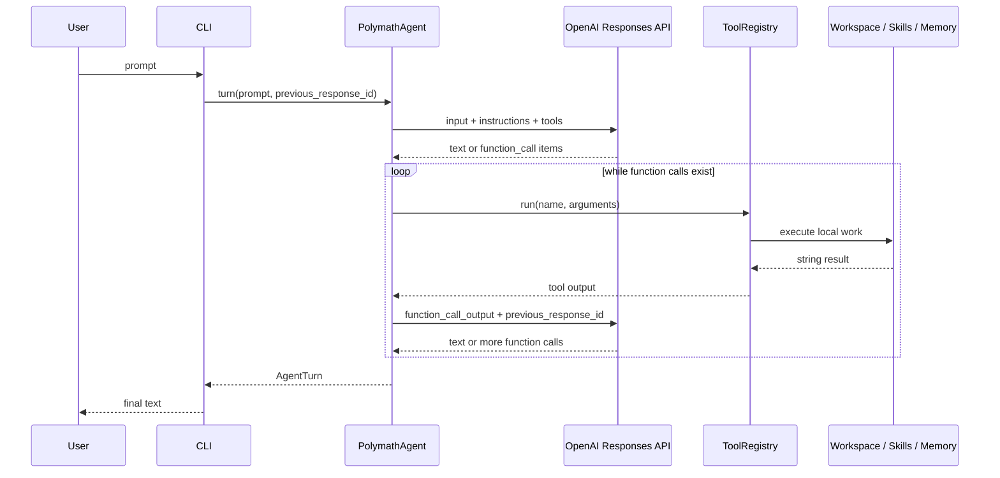

# Architecture

Polymath Agent Python is built around one idea: keep the agent loop visible. A model receives tool
schemas, asks for function calls when it needs outside information, and the Python runtime executes
those calls locally.

## Main Components

`polymath_agent.agent.PolymathAgent`

The central orchestration class. It builds the system prompt, creates OpenAI responses, extracts
function calls, runs local tools, and returns final text.

`polymath_agent.tools.ToolRegistry`

A deterministic local dispatcher. The registry stores tool definitions and the Python callables
that implement them. The model never executes code directly; it requests a named tool with JSON
arguments, and the registry routes the request.

`polymath_agent.skills.SkillsRepository`

Discovers `.skills/<name>/SKILL.md` files, validates frontmatter, injects lightweight metadata into
the system prompt, and reads bundled skill references safely.

`polymath_agent.memory.MemoryStore`

A small JSON-backed memory store. It is intentionally simple and inspectable.

`polymath_agent.heartbeat.Heartbeat`

Writes `.polymath/heartbeat.json` so a running agent can be inspected from another terminal.

## Why Responses API

The Responses API is designed for stateful, tool-using workflows. This project uses
`previous_response_id` so the model can continue after tool results without resending a full chat
history on every call. The agent still sends `instructions` and `tools` every time because those are
part of the current runtime contract.

## Error Boundaries

Tool failures are returned to the model as strings that start with `error:`. This keeps the agent
loop alive when a file is missing, a URL fails, or a model passes invalid arguments. Unexpected
Python exceptions are also normalized by `ToolRegistry.run(...)`.

## Why No Agent Framework

For a course project, the agent loop itself is the lesson. A framework would hide useful details:
tool schemas, call IDs, output messages, continuation requests, and local safety checks. This code
keeps those details in normal Python modules with tests.
